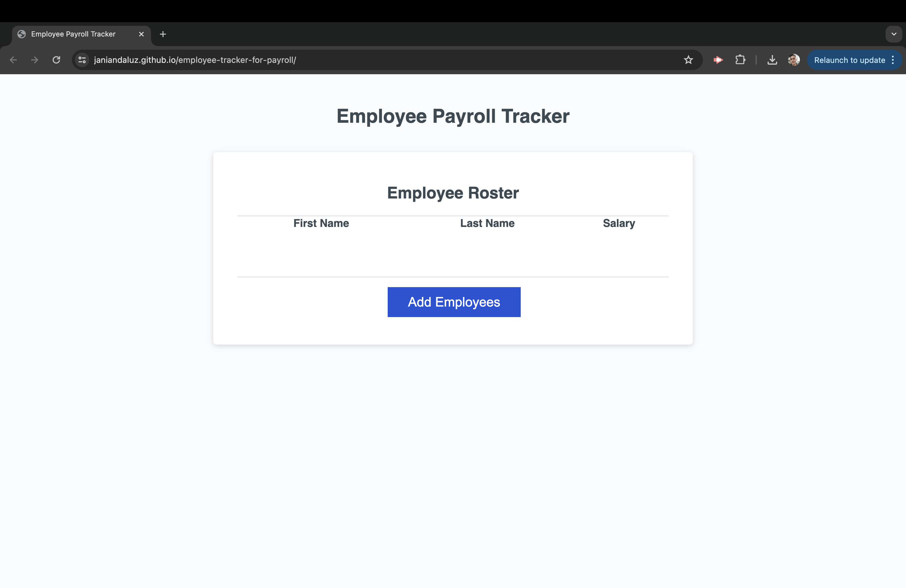

# Employee Payroll Tracker

## Description
The Employee Payroll Tracker is a web application designed for payroll managers to efficiently manage and track employee payroll data. It provides a user-friendly interface for adding employee details such as first name, last name, and salary. Upon completion, the entered data is displayed in a table format, sorted alphabetically by the employees' last names. Additionally, the application calculates and displays the average salary of all employees and randomly selects an employee for special recognition.

## Usage
1. Adding Employees: Click the "Add Employees" button to initiate the process.
2. Input Employee Data: Enter the first name, last name, and salary of each employee when prompted.
3. Continuation: Choose to continue adding employees or cancel when finished.
4. Data Display: Upon cancellation, the employee data will be displayed on the page sorted alphabetically by last name.
5. Additional Features: The application calculates and displays the average salary of the employees and randomly selects an employee for acknowledgment.

[This isthe link to the website:](https://thecaprifire.github.io/employee-tracker-for-payroll/)
[This is the link to the GitHub repository:](https://github.com/janiandaluz/employee-tracker-for-payroll)
[This is the youtube link for the website screen record:](https://youtu.be/Opuz0bwCOfU)

## Functions
1. collectEmployees
    - Description: Collects employee data through prompts and returns an array of employee objects.
    - Usage: Call this function to collect employee data.
2. displayAverageSalary
    - Description: Calculates and displays the average salary of the employees.
    - Usage: Call this function and pass the array of employee objects as an argument.
3. getRandomEmployee
    - Description: Selects and displays a random employee from the provided array of employee objects.
    - Usage: Call this function and pass the array of employee objects as an argument.

## Technologies Used
1. HTML
2. CSS
3. JavaSrcipt

## Contributing
Contributions are welcome! If you find any issues or have suggestions for improvement, feel free to open an issue or submit a pull request.

## Credits
- Credits given to fellow boot campers, TAs, and instructor.
- Clone the starter code from canvas with the given link: [Code Refactor Starter Code](https://github.com/coding-boot-camp/curly-potato)
- Credits to the following links:
    - [Crerating a while loop](https://developer.mozilla.org/en-US/docs/Web/JavaScript/Reference/Statements/while)
    - [isNan Function](https://developer.mozilla.org/en-US/docs/Web/JavaScript/Reference/Global_Objects/isNaN)
    - [return Declarations](https://developer.mozilla.org/en-US/docs/Web/JavaScript/Reference/Statements/return)
    - [Math.random Usage](https://developer.mozilla.org/en-US/docs/Web/JavaScript/Reference/Global_Objects/Math/random)

## License
This project is licensed under the MIT License.
